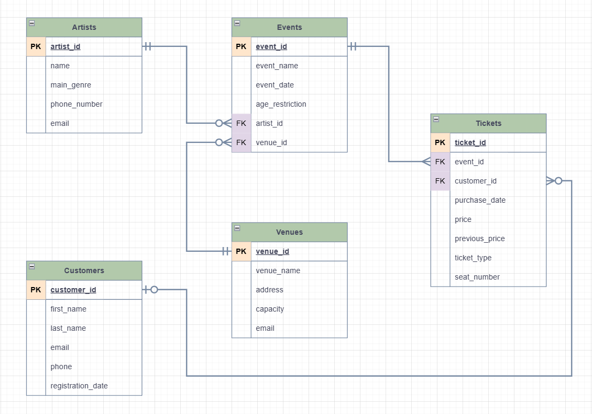

# Система управления музыкальным фестивалем

---

### Введение

##### **_Цель работы:_**

Получение практических навыков работы с промышленными СУБД, проектирование БД (концептуальное, логическое, физическое), создание хранимых процедур, представлений, триггеров, индексов.

---

#### **_Инструменты:_**

PostgreSQL 15, Git, Python

---

#### **_Описание проекта:_**

Проект реализует систему управления музыкальным фестивалем, которая позволяет администрировать артистов, фестивальные события, площадки проведения, а также продажу билетов с подробной информацией о покупателях.

---

#### **_Предметная область и сущности:_**

**Сущности проекта:**

1. **Artists (Артисты)**
2. **Events (События)**
3. **Venues (Площадки)**
4. **Tickets (Билеты)**
5. **Customers (Покупатели)**

---

#### **_Подробное описание каждой сущности:_**

### Таблица 1. Artists (Артисты)

**Поля таблицы:**

- **artist_id** – SERIAL PRIMARY KEY  
  Уникальный идентификатор артиста.
- **name** – VARCHAR(20) NOT NULL  
  Название группы или имя исполнителя.
- **main_genre** – VARCHAR(20)  
  Основной музыкальный жанр.
- **phone_number** – VARCHAR(20) NOT NULL CHECK (phone_number ~ '^\+[0-9]{7,15}$')  
  Контактный номер для связи с менеджером.
- **email** – VARCHAR(50) NOT NULL CHECK (email ~ '^[A-Za-z0-9._%+-]+@[A-Za-z0-9.-]+\.[A-Za-z]{2,}$')  
  Электронная почта для связи с менеджером.

---

### Таблица 2. Events (Концерты/События)

**Назначение:**  
Хранит данные о проведении фестивальных событий.

**Поля таблицы:**

- **event_id** – SERIAL PRIMARY KEY  
  Уникальный идентификатор события.
- **event_name** – VARCHAR(100) NOT NULL  
  Название события или концерта.
- **event_date** – TIMESTAMP NOT NULL  
  Дата и время проведения события.
- **venue_id** – INTEGER NOT NULL  
  Внешний ключ, ссылающийся на таблицу Venues.
- **age_restriction** – INTEGER CHECK (age_restriction >= 0)  
  Возрастное ограничение для посещения события (например, 18+).
- **artist_id** – INTEGER NOT NULL  
  Внешний ключ, ссылающийся на таблицу Artists (указывает на основного артиста, выступающего на событии).

---

### Таблица 3. Venues (Площадки)

**Назначение:**  
Хранит информацию о местах проведения фестиваля.

**Поля таблицы:**

- **venue_id** – SERIAL PRIMARY KEY  
  Уникальный идентификатор площадки.
- **venue_name** – VARCHAR(50) NOT NULL  
  Название площадки (например, «Главная сцена», «Открытая площадка»).
- **address** – VARCHAR(100) NOT NULL
  Физический адрес площадки.
- **capacity** – INTEGER CHECK (capacity > 0)  
  Вместимость площадки (количество мест).
- **email** – VARCHAR(50) NOT NULL CHECK (email ~ '^[A-Za-z0-9._%+-]+@[A-Za-z0-9.-]+\.[A-Za-z]{2,}$')  
  Электронная почта для связи с представителями площадки.

---

### Таблица 4. Tickets (Билеты) – с реализацией SCD Type 3

**Поля таблицы:**

- **ticket_id** – SERIAL PRIMARY KEY  
  Уникальный идентификатор билета.
- **event_id** – INTEGER NOT NULL  
  Внешний ключ, ссылающийся на таблицу Events.
- **customer_id** – INTEGER  
  Внешний ключ, ссылающийся на таблицу Customers (может быть NULL, если билет ещё не продан).
- **purchase_date** – TIMESTAMP  
  Дата и время покупки билета. Если билет не продан, значение может быть NULL.
- **price** – INTEGER NOT NULL CHECK (price >= 0)  
  Текущая цена билета.
- **previous_price** – INTEGER  
  Предыдущая цена билета _(SCD Type 3)_.
- **ticket_type** – VARCHAR(50)  
  Вид билета. Возможные значения:
  - **standart** – базовый билет (цена равна стандартной цене).
  - **standart+** – расширенный вариант базового билета с дополнительными преимуществами (например, ускоренный вход).
  - **premium** – билет с дополнительными фичами (например, VIP-место, доступ в зону бэкстейдж).
- **seat_number** – INTEGER CHECK (seat_number >= 0)  
  Номер места.

_Реализация SCD Type 3:_  
При обновлении данных в таблице **Tickets** (например, изменение цены) текущее значение поля `price` копируется в поле `previous_price`, после чего в `price` записывается новое значение. Таким образом, таблица хранит актуальное состояние и последнее предыдущее изменение цены.

---

### Таблица 5. Customers (Покупатели/Посетители)

**Назначение:**  
Хранит данные о клиентах, приобретающих билеты.

**Поля таблицы:**

- **customer_id** – SERIAL PRIMARY KEY  
  Уникальный идентификатор клиента.
- **first_name** – VARCHAR(20) NOT NULL  
  Имя покупателя.
- **last_name** – VARCHAR(20) NOT NULL  
  Фамилия покупателя.
- **email** – VARCHAR(50) UNIQUE NOT NULL CHECK (email ~ '^[A-Za-z0-9._%+-]+@[A-Za-z0-9.-]+\.[A-Za-z]{2,}$')  
  Электронная почта для связи.
- **phone** – VARCHAR(20) UNIQUE NOT NULL CHECK (phone ~ '^\+[0-9]{7,15}$')  
  Контактный телефон.
- **registration_date** – TIMESTAMP DEFAULT CURRENT_TIMESTAMP  
  Дата регистрации или первого заказа.

---

### Итоговая схема

- **Artists:** Таблица для хранения информации об исполнителях (artist_id, name, main_genre, phone_number, email).
- **Events:** Таблица с данными о фестивальных событиях (event_id, event_name, event_date, venue_id, age_restriction, artist_id). Содержит внешние ключи на таблицы Venues и Artists.
- **Venues:** Таблица для информации о площадках (venue_id, venue_name, address, capacity, email).
- **Tickets:** Таблица для билетов (ticket_id, event_id, customer_id, purchase_date, price, previous_price, ticket_type, seat_number) с реализацией SCD Type 3.
- **Customers:** Таблица для данных покупателей (customer_id, first_name, last_name, email, phone, registration_date).

---

#### **_Заключение:_**

Проект "Система управления концертами" разработан с учетом требований к нормализации данных. Особое внимание уделено таблице **Tickets**, где реализована система версионирования по SCD Type 3, позволяющая хранить актуальное состояние и последнее предыдущее изменение цены билета. Такая архитектура обеспечивает целостность данных и гибкость управления информацией.
